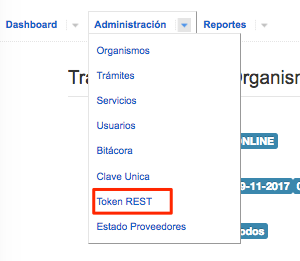
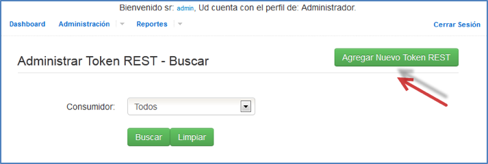
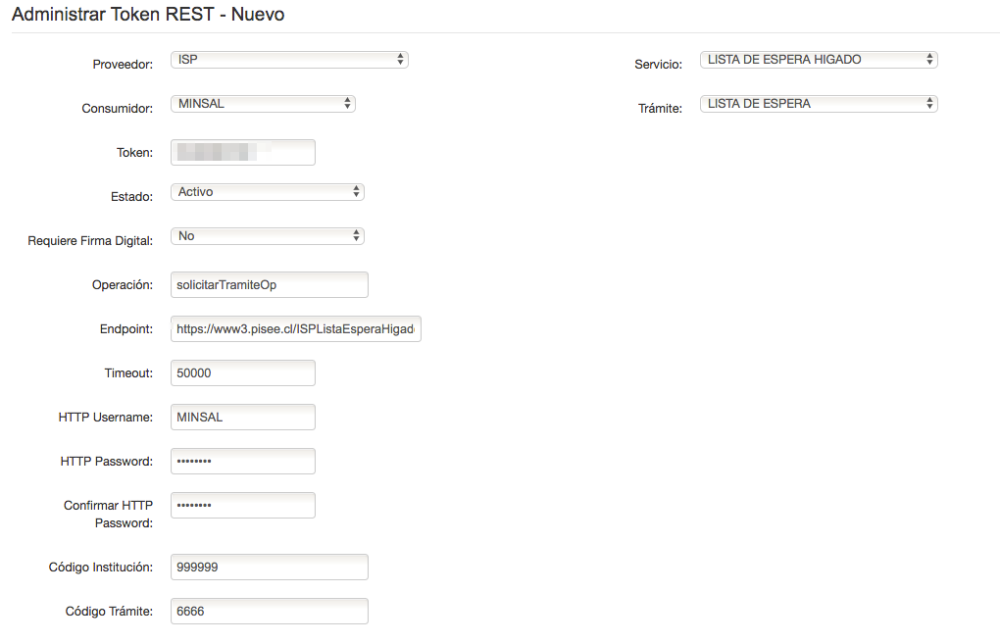

# Backoffice REST

<!-- TOC -->

- [Backoffice REST](#backoffice-rest)
  - [Objetivo](#objetivo)
  - [Instalación](#instalación)
    - [Dependencias](#dependencias)
    - [Clonar e Instalar en ambiente local](#clonar-e-instalar-en-ambiente-local)
  - [Nuevas Integraciones](#nuevas-integraciones)
    - [Requisitos](#requisitos)
      - [Generar token Rest](#generar-token-rest)
    - [Agregar Nuevo Servicio REST](#agregar-nuevo-servicio-rest)
      - [Clase Rest para proveedor](#clase-rest-para-proveedor)
    - [Archivos de Configuración](#archivos-de-configuración)
    - [Crear Endpoint para operación](#crear-endpoint-para-operación)

<!-- /TOC -->

## Objetivo

Este proyecto se creo con la finalidad de exponer los servicios de la PISEE (SOAP) en formato REST. Disminuyendo asi las barreras para que las instituciones se integren a la nueva normativa de `Interoperabilidad`.

## Instalación

### Dependencias

- Java JDK.
- Apache ANT.
- Maven.
- Configuración del repositorio jboss en maven, como se explica en el readme del proyecto `Pisee-Backoffice`.

### Clonar e Instalar en ambiente local

1. Clonar el proyecto git:

```bash
 git clone git@github.com:e-gob/pisee-backoffice-rest.git
```

1. Importar en JBoss Developer como `Maven Project`.

1. Copiar los archivos de configuración de las integraciones REST desde el directorio `PiseeConf/rest_services` del proyecto `Pisee` en el directorio

```bash
$JBOSS_HOME/server/<INSTANCIA>/deploy/base/piseeConf/
```

## Nuevas Integraciones

### Requisitos

1. El servicio a integrar, debe estar previamente configurado y operando bajo SOAP dentro de la PISEE.

1. Se debe contar con el XML de entrada y de salida del servicio a integrar.

#### Generar token Rest

- Ingresar a la consola de backoffice-web

- `Administracion`-> `Token Rest`



- `Agregar Nuevo Token Rest`



- Ingresar parámetros correspondientes al servicio que se desea disponibilizar via rest.

  - Token: Corresponde a una cadena de caracteres la cual asocia al Proveedor-Servicio-Consumidor-Tramite. Debe ser alfanumérico. (se genera manualmente)

  - Operación: `solicitarTramiteOp`

  - Endpoint: URL en donde se encuentra expuesto el servicio (La misma usada para consultar por ejemplo, a través de SoapUI)

  - Timeout: Tiempo en milisegundos para el Timeout (50.000)

  - HTTP Username: Credencial del organismo consumidor

  - HTTP Password: Credencial del organismo consumidor

  - Requiere Firma Digital: Indica si dicho servicio requiere firma digital

  - Código Institución: Utilizado para la generación del ID Sobre

  - Código Trámite: Utilizado para la generación del ID Sobre



### Agregar Nuevo Servicio REST

#### Clase Rest para proveedor

Por cada proveedor de servicio que expone sus servicio mediante rest, debe existir en el proyecto `pisee-rest` una clase:

    cl.gob.minsegpres.pisee.rest.services.Rest<INSTITUCION>

por ejemplo:

    cl.gob.minsegpres.pisee.rest.services.RestIsp.java`


Además, en esta clase se agregaran los enpoints que de diponibilizaran mediante Rest.

Cada institucíon a la que se le crea una clase Rest, se debe configurar en el archivo

    rest-web/src/main/webapp/WEB-INF/applicationContext.xml


### Archivos de Configuración

Estos archivos permiten hacer la relación entre los parámetros de entrada y salida, y su correspondencia en REST.

- Lo primero es crear una constante, con el nombre de los arhivos de configuración para el servicio: `rest-web/src/main/java/cl/gob/minsegpres/pisee/rest/util/ConfigProveedoresServicios.java`

  Para esto se utiliza la convención de nombre:

  `SOAP_<INSTITUCIÓN>_<SERVICIO_A_CONSUMIR>`

  por ejemplo:

  ```java
  public static final String SOAP_ISP_LISTADO_ESPERA_HIGADO	= "SOAP_ISP_ListadoEsperaHigado";
  ```

  

- Una vez configuradas las constante, se deben generar los archivos necesarios para consumir el servicio, tomando como base el valor de la constante creada. Estos archivos se encuentra versionados en el Proyecto [Pisee](https://github.com/e-gob/pisee/tree/master/piseeConf/rest_services)/piseeConf y existe una versión distinta para producción y testing.

  

- Deben crearse a lo menos 2 archivos, uno para los parámetros de entrada y uno para los parámetros de salida del servicio. Además, si el servicio requiere el uso de certificados, se debe crear un tercer archivo con el keystore necesario.

  ejemplo:

    SOAP_ISP_ListadoEsperaHigado_input.xml
    SOAP_ISP_ListadoEsperaHigado_outpu.xml

- los archivos de configuración de las integraciones REST deben copiarse al directorio de deploy:

```bash
$JBOSS_HOME/server/<INSTANCIA>/deploy/base/piseeConf/
```

### Crear Endpoint para operación

El ultimo paso, es crear el endpoint, que realizara la llamada SOAP, cuando se reciba una llamada REST.


Así, finalmente la url para encontrar el servicio sera:

    <URL-BASE>/rest-web/<@PATH>/<ENDPOINT>?<Parametros>

  ejemplo:

  [http://www3.pisee.cl:8080/rest-web/isp/v1/listado_espera_higado?pisee_token=ASDF](http://www3.pisee.cl:8080/rest-web/isp/v1/listado_espera_higado?pisee_token=ASDF)

  respuesta ejemplo:

  
